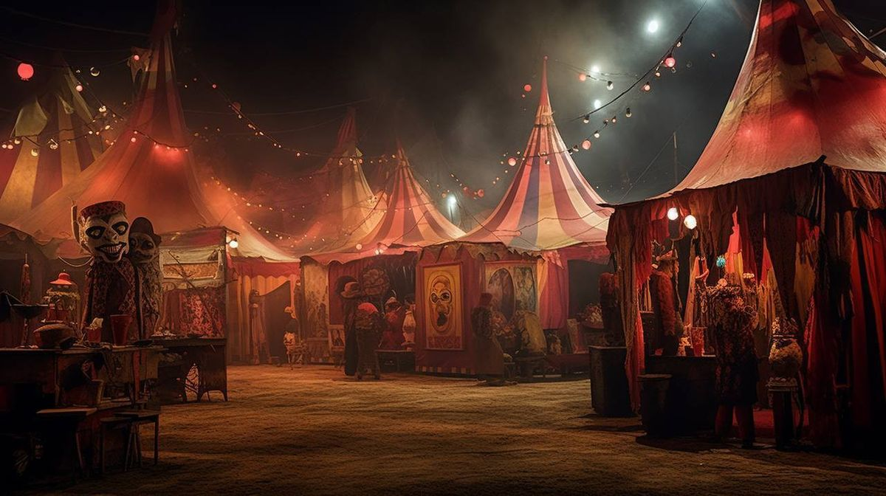

# ✨ Bem-vindos ao Circo de Soled! ✨
> *"Onde a arte, a cor e a loucura se encontram no palco dos pixels."* 🎭🃏

---

  

### 🃏 O Gran Circo das Ilusões
Entre, entre! Não tenha medo da névoa. Este espaço não foi projetado para ser um portfólio corporativo polido, nem uma vitrine sóbria de métricas engessadas — é um espetáculo visceral de testes gráficos, experimentos visuais e interfaces movidas a pura provocação estética. Como diria o Coringa, *"se você precisa explicar uma piada, ela não tem graça"* — e o mesmo vale para a nossa arte. 

Se você veio procurar layouts previsíveis para reuniões formais de negócios... lamento, errou de tenda! Aqui nós não seguimos regras de design tradicional; nós desafiamos a lógica, invocamos feitiçaria em forma de interface e abraçamos o caos antes que ele nos devore. 🔮🎩

---

### 🎭 Truques de Mágica & Grimório Visual
* 🎨 **Feitiçaria de Interfaces:** Figma *(o verdadeiro caldeirão onde os conceitos mais caóticos, vibrantes e anárquicos ganham vida e forma)*
* 🪄 **Ilusionismo Web:** HTML & CSS *(a arte delicada e obstinada de manter as marionetes de pixels de pé sobre o palco digital)*
* 🧵 **Fios de Marionete:** Protótipos frenéticos, interações audaciosas e testes rápidos que ninguém pediu, mas que o impulso criativo exigiu existir
* 🃏 **Cartomancia Gráfica:** Memes, edições duvidosas, artes conceituais e colagens visuais desenhadas nas sombras da noite

---

### 📜 Atrações em Cartaz no Picadeiro
> *"Can't read my, can't read my / No, he can't read my poker face / (She's got me like nobody) / P-p-p-poker face, p-p-poker face"*  
> — Lady Gaga, *Poker Face*

No grande jogo do picadeiro, cada tela é uma aposta alta, um blefe bem executado e uma máscara impecável. Por trás da superfície perfeita e do olhar inexpressivo da interface, escondem-se o frenesi, o mistério e o jogo psicológico de quem controla as cartas sem revelar o próximo movimento. Aqui, o público vê apenas a ilusão, mas o mistério permanece intacto:

* 🎪 **Espetáculo das Cores:** Paletas vibrantes, contrastes agressivos e combinações cromáticas que desafiam o bom senso e hipnotizam o espectador.
* 🎭 **A Máscara do Layout:** Telas, botões e arquiteturas de informação criados puramente para testar conceitos, provocar os sentidos e explorar limites.
* 👁️ **O Espelho do Caos:** Projetos em constante metamorfose que mudam de forma a qualquer segundo por causa da névoa da inspiração.

---

### 🧐 Regras da Tenda
1. Não olhe fixamente para o código sem proteção ocular — o abismo dos pixels pode olhar de volta para você.
2. Elogios ao Palhaço/Mestre de Cerimônias garantem imunidade contra bugs misteriosos e exceções não tratadas.
3. *Praise The Fool!* 🧐✨

---

  

  🎪 Espetáculo produzido com 90% de ilusão, 10% de gambiarra e 0% de profissionalismo.

